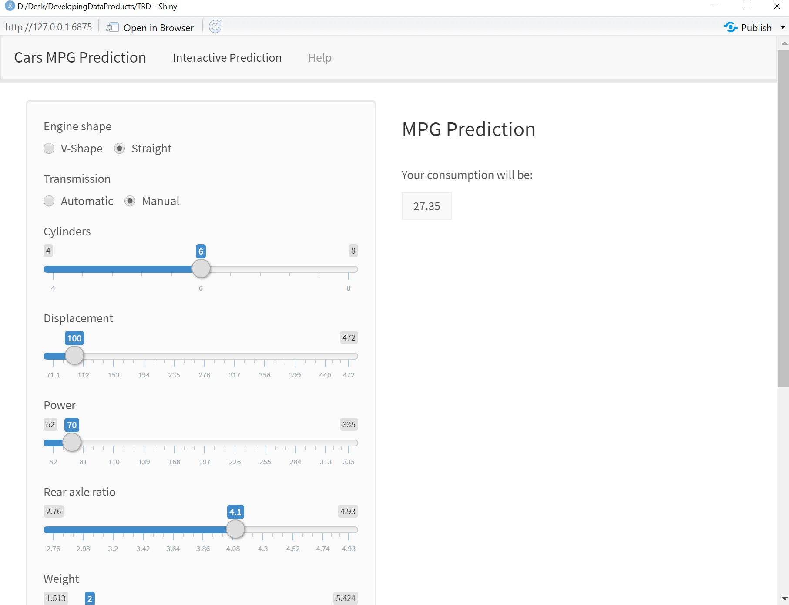

```{r setup, include=FALSE}
knitr::opts_chunk$set(echo = TRUE)
```

# Introduction
The application made is a miles per gallon predictor based on the mtcars dataset. The user can set the values of the different parameters in the UI and the app will output its prediction.The application is made using ***Shiny***. The dataset used by the application is the Dataset used by the application is the [Motor Trend Car Road Tests](https://stat.ethz.ch/R-manual/R-devel/library/datasets/html/mtcars.html) (from now on *'mtcars'*). The data was extracted from the ***1974 Motor Trend*** US magazine, and comprises fuel consumption and 10 aspects of automobile design and performance for 32 automobiles (1973-74 models).


# The dataset
The mtcars data set is a 32 x 11 dataset with 32 different type of cars and 11 different parameters.
```{r}
head(mtcars)
str(mtcars)
dim(mtcars)
```
# The prediction model
A Random Forest prediction model is generated and trained using the *'mtcars'* dataset. The goal of this model is to predict the fuel consumption (***mpg*** outcome) based on the rest of the variables:
```{r echo = FALSE}
suppressWarnings(suppressMessages(library(caret)))
suppressWarnings(suppressMessages(library(randomForest)))
set.seed(60917)
```

```{r echo = TRUE}
library(caret)
library(randomForest)
library(ggplot2)
library(lattice)
customTrainControl <- trainControl(method = "cv", number = 10)
carsRandomForestModelBuilder <- function() {
  return(train(mpg ~ ., 
         data = mtcars,
         method = "rf",
         trControl = customTrainControl) )
}
carsRandomForestModelBuilder()
```

# Example
```{r pressure, echo=FALSE, fig.cap="A caption", out.width = '100%'}

```

